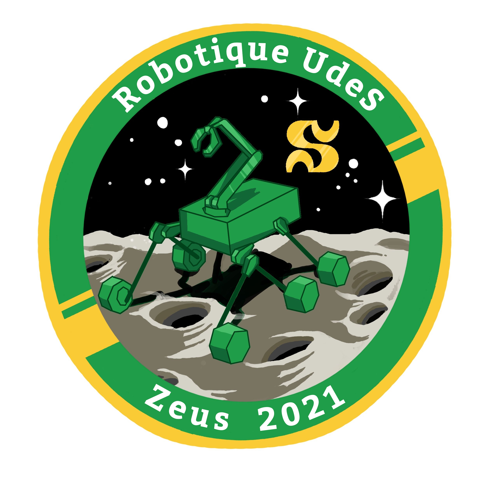
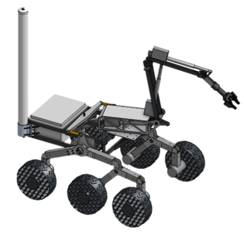

# zeus_rover

This repository contains all the code necessary for our rover Zeus, which will participate to the 2021 CIRC competition.


<!--  -->


## Requirements

- Ubuntu 18.04
- ROS Melodic


## Installation :
```
cd <your_catkin_ws>/src
git clone https://github.com/robotique-udes/zeus_rover.git
cd zeus_rover
catkin_make
```

## Packages



This repository is divided in several ROS packages. Each package is briefly described below and has its own readme file with more details.

### ros_talon

This package is used to control our motors with the talon srx drive. This package was cloned from [this repository](https://github.com/jtdevs/ros_talon) and slightly modified for our needs.

### zeus_arm

This package contains all the code necessary to control our robotic arm, both in simulation and the real arm. There are two available teleoperation modes: joint control and cartesian control. 

### zeus_control

This package contains all the code necessary to control our rover, including the low-level control, the teleoperation stack, some sensor drivers, and pan-tilt camera control.

### zeus_description

This package contains our rover description to be simulated in Gazebo.

### zeus_gazebo

This package contains the code to launch our simulation as well as the worlds we use.

### zeus_moveit_config

This package contains the moveit configuration for our robot arm.

### zeus_navigation

This package contains the code to configure and launch move base for our rover.

### zeus_science

This package contains the code to control our land sampling system.


In the future, our Doxygen documentation will be here: https://robotique-udes.github.io/zeus_rover/