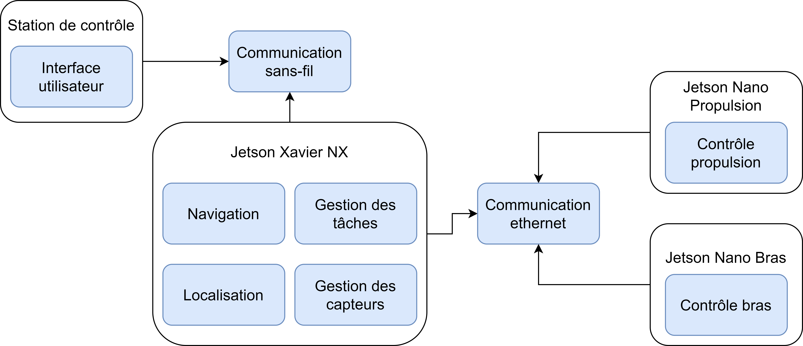
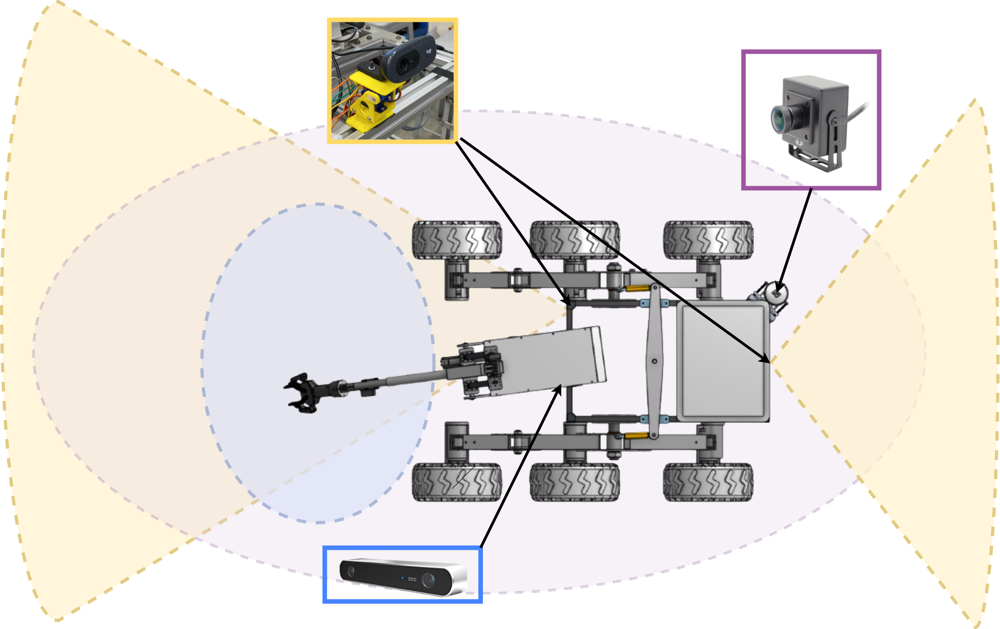
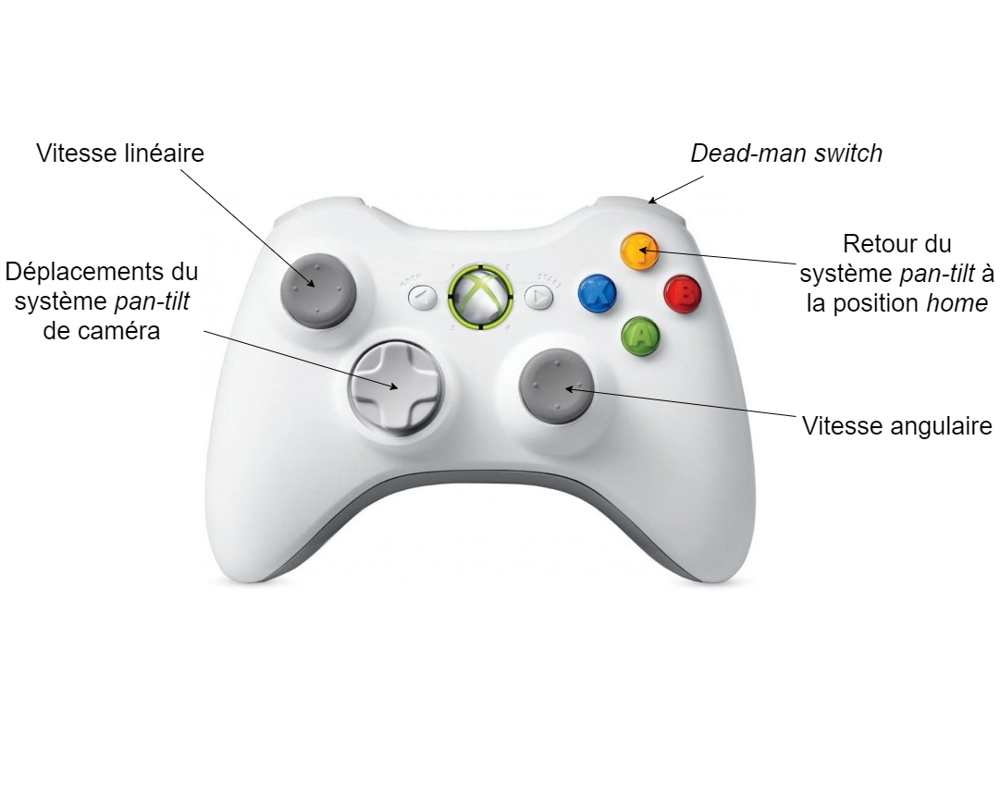
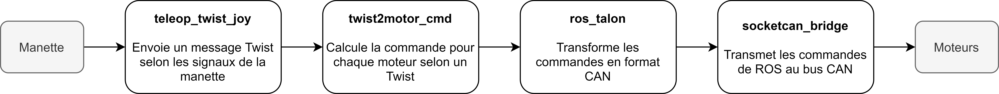
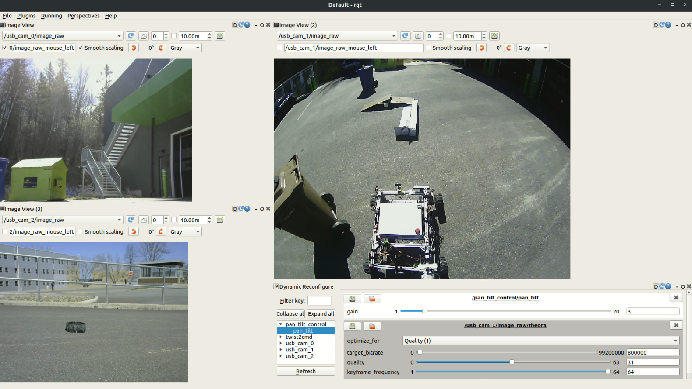

# zeus_control

<!--  -->

This package contains all the necessary code to operate both the real robot and the gazebo simulation manually.
The drivers for visualization include two USB cameras mounted on pan-tilt, systems, a wide angle camera and a ZED stereo camera.

The control structure goes from joystick signals to motor speed commands.

## File structure

#### arduino
This folder contains the arduino code to control the pan tilt system for the cameras. It receives commands through ROS serial and moves accordingly.

#### config
This folder contains multiple configuration files for teleop configuration, sensor parameters, sensor fusion parameters, as well as our interface configuration file in rqt.

#### launch
This folder has the necessary launch files to run the teleop, the sensors and the user interface.

#### src
This folder has all the python files. 

- `odom_publisher.py` and `odom_publisher_sim.py` contain the code developed to publish the rover odometry from wheel encoder measurements. 

- `pan_tilt_joy.py` is a script that subscribes to joy messages and sends position commands to the pan-tilt camera system. 

- `sensor_monitor.py` is not used for the moment, but will help us monitor the sensors' publish rate to make sure they are up and running.

- `twist2motor_cmd.py` subscribes to twist messages and outputs 6 motor commands accordingly. Multiple parameters can be tuned by the user to control the rover. 

## Dependencies
### ROS standard packages
joy
teleop_twist_joy
image_transport_plugins
swri_transform_util
gps_common

### Mapviz
Mapviz is used to show rover's position and orientation on a satellite map. 
To install and use it follow steps here

