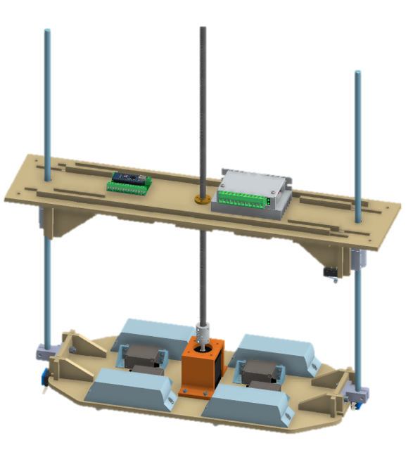
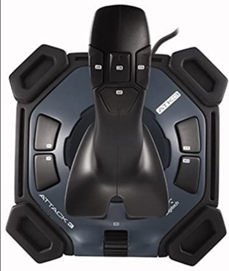

# zeus_science

This package contains all the necessary code to operate our sampling system.

The module is operated with a logitech joystick as shown below. Buttons 1, 3, 5, and 7 are used to open each one of the sample containers, and buttons 2, 4, 6, and 8 are used to close them. Button 9 is used to move the platform down and button 10 to move it up.

## File structure

### arduino

This folder contains the arduino code which controls sampling system motors. It subscribes to commands through rosserial and executes them accordingly.

#### launch
This folder has the necessary launch files to run the system. 

#### scripts
This folder contains the python node to send commands to the module and the arduino code which controls it. 

- `teleop.py` simply subscribes to the joystick signals and sends the sampling system the corresponding commands. 

